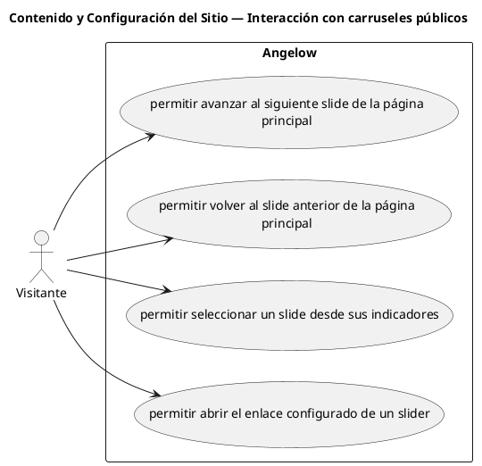

# Contenido y Configuración del Sitio — Interacción con carruseles públicos

> 4 casos de uso del subproceso.

## Casos cubiertos

- El sistema debe permitir avanzar al siguiente slide de la página principal.
- El sistema debe permitir volver al slide anterior de la página principal.
- El sistema debe permitir seleccionar un slide desde sus indicadores.
- El sistema debe permitir abrir el enlace configurado de un slider.

## Referencias

- [Índice de diagramas](../README.md)
- [Matriz de requerimientos funcionales](../../matriz-requerimientos-funcionales-actualizada.md)
- [Especificación de casos de uso](../../casos-uso-angelow.md)
