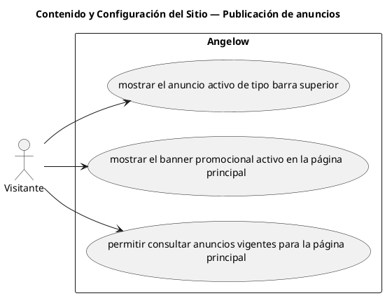

# Contenido y Configuración del Sitio — Publicación de anuncios

> 3 casos de uso del subproceso.

## Casos cubiertos

- El sistema debe mostrar el anuncio activo de tipo barra superior.
- El sistema debe mostrar el banner promocional activo en la página principal.
- El sistema debe permitir consultar anuncios vigentes para la página principal.

## Referencias

- [Índice de diagramas](../README.md)
- [Matriz de requerimientos funcionales](../../matriz-requerimientos-funcionales-actualizada.md)
- [Especificación de casos de uso](../../casos-uso-angelow.md)
