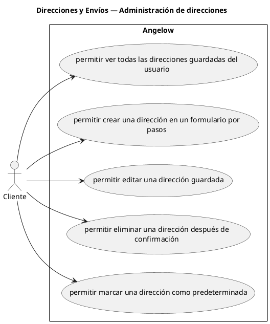

# Direcciones y Envíos — Administración de direcciones

> 5 casos de uso del subproceso.

## Casos cubiertos

- El sistema debe permitir ver todas las direcciones guardadas del usuario.
- El sistema debe permitir crear una dirección en un formulario por pasos.
- El sistema debe permitir editar una dirección guardada.
- El sistema debe permitir eliminar una dirección después de confirmación.
- El sistema debe permitir marcar una dirección como predeterminada.

## Referencias

- [Índice de diagramas](../README.md)
- [Matriz de requerimientos funcionales](../../matriz-requerimientos-funcionales-actualizada.md)
- [Especificación de casos de uso](../../casos-uso-angelow.md)
