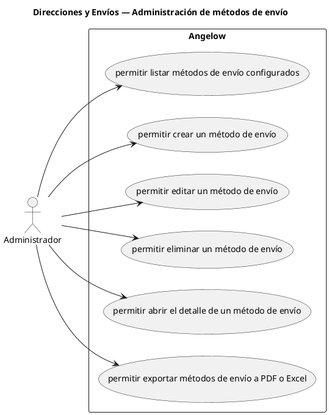

# Direcciones y Envíos — Administración de métodos de envío

> 6 casos de uso del subproceso.

## Casos cubiertos

- El sistema debe permitir listar métodos de envío configurados.
- El sistema debe permitir crear un método de envío.
- El sistema debe permitir editar un método de envío.
- El sistema debe permitir eliminar un método de envío.
- El sistema debe permitir abrir el detalle de un método de envío.
- El sistema debe permitir exportar métodos de envío a PDF o Excel.

## Referencias

- [Índice de diagramas](../README.md)
- [Matriz de requerimientos funcionales](../../matriz-requerimientos-funcionales-actualizada.md)
- [Especificación de casos de uso](../../casos-uso-angelow.md)
