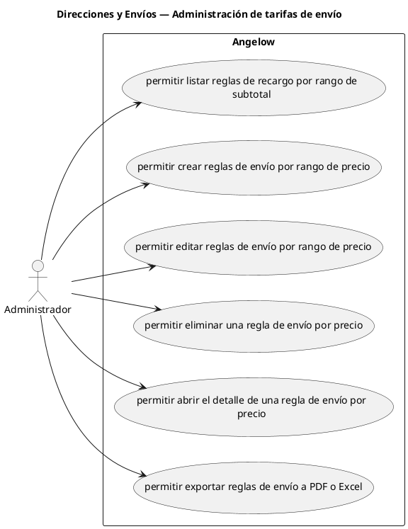

# Direcciones y Envíos — Administración de tarifas de envío

> 6 casos de uso del subproceso.

## Casos cubiertos

- El sistema debe permitir listar reglas de recargo por rango de subtotal.
- El sistema debe permitir crear reglas de envío por rango de precio.
- El sistema debe permitir editar reglas de envío por rango de precio.
- El sistema debe permitir eliminar una regla de envío por precio.
- El sistema debe permitir abrir el detalle de una regla de envío por precio.
- El sistema debe permitir exportar reglas de envío a PDF o Excel.

## Referencias

- [Índice de diagramas](../README.md)
- [Matriz de requerimientos funcionales](../../matriz-requerimientos-funcionales-actualizada.md)
- [Especificación de casos de uso](../../casos-uso-angelow.md)
