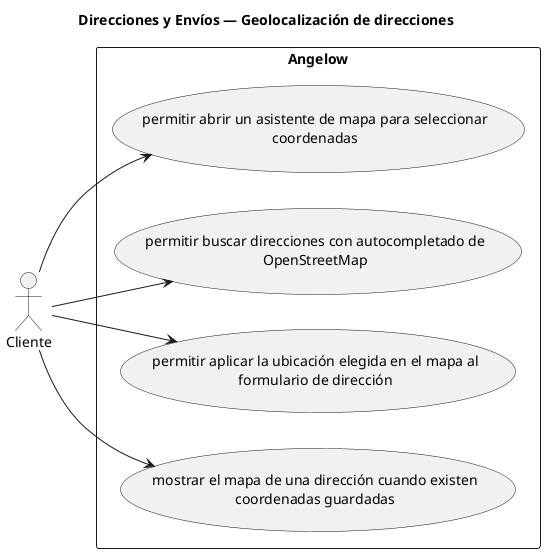

# Direcciones y Envíos — Geolocalización de direcciones

> 4 casos de uso y 1 requerimientos internos relacionados del subproceso.

## Casos cubiertos

- El sistema debe permitir abrir un asistente de mapa para seleccionar coordenadas.
- El sistema debe permitir buscar direcciones con autocompletado de OpenStreetMap.
- El sistema debe permitir aplicar la ubicación elegida en el mapa al formulario de dirección.
- El sistema debe mostrar el mapa de una dirección cuando existen coordenadas guardadas.

## Requerimientos internos relacionados

## Requerimientos internos relacionados

- El sistema debe convertir coordenadas en datos legibles para mostrar mejor la ubicación.
  - Tipo: integración interna de geocodificación.
  - Disparador: se dispone de coordenadas para construir una dirección visible.
  - Actor directo: no aplica.
  - Contexto: dirección con coordenadas.
  - Representación: conversión interna de coordenadas a datos legibles.

## Referencias

- [Índice de diagramas](../README.md)
- [Matriz de requerimientos funcionales](../../matriz-requerimientos-funcionales-actualizada.md)
- [Especificación de casos de uso](../../casos-uso-angelow.md)
