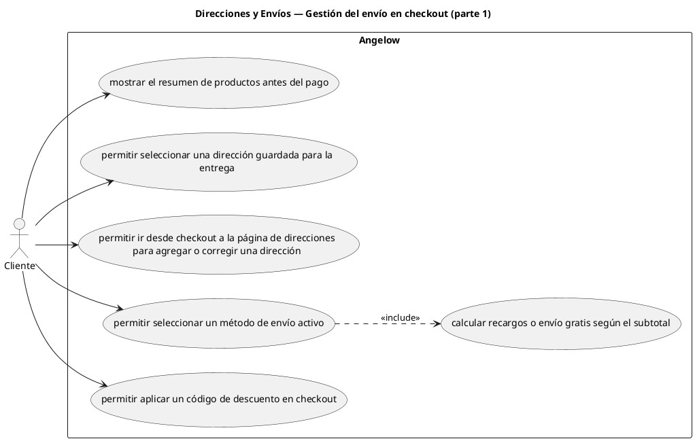

# Direcciones y Envíos — Gestión del envío en checkout (parte 1)

> 6 casos de uso del subproceso.

## Casos cubiertos

- El sistema debe mostrar el resumen de productos antes del pago.
- El sistema debe permitir seleccionar una dirección guardada para la entrega.
- El sistema debe permitir ir desde checkout a la página de direcciones para agregar o corregir una dirección.
- El sistema debe permitir seleccionar un método de envío activo.
- El sistema debe calcular recargos o envío gratis según el subtotal.
- El sistema debe permitir aplicar un código de descuento en checkout.

## Referencias

- [Índice de diagramas](../README.md)
- [Matriz de requerimientos funcionales](../../matriz-requerimientos-funcionales-actualizada.md)
- [Especificación de casos de uso](../../casos-uso-angelow.md)
