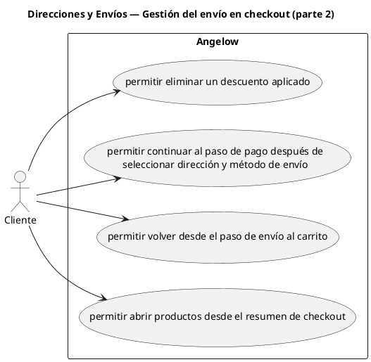

# Direcciones y Envíos — Gestión del envío en checkout (parte 2)

> 4 casos de uso y 1 requerimientos internos relacionados del subproceso.

## Casos cubiertos

- El sistema debe permitir eliminar un descuento aplicado.
- El sistema debe permitir continuar al paso de pago después de seleccionar dirección y método de envío.
- El sistema debe permitir volver desde el paso de envío al carrito.
- El sistema debe permitir abrir productos desde el resumen de checkout.

## Requerimientos internos relacionados

## Requerimientos internos relacionados

- El sistema debe aplicar automáticamente descuentos por cantidad cuando el carrito cumple las reglas.
  - Tipo: cálculo automático.
  - Disparador: el carrito cumple una regla de descuento por cantidad.
  - Actor directo: no aplica.
  - Contexto: checkout activo.
  - Representación: regla interna aplicada durante el cálculo del checkout.

## Referencias

- [Índice de diagramas](../README.md)
- [Matriz de requerimientos funcionales](../../matriz-requerimientos-funcionales-actualizada.md)
- [Especificación de casos de uso](../../casos-uso-angelow.md)
