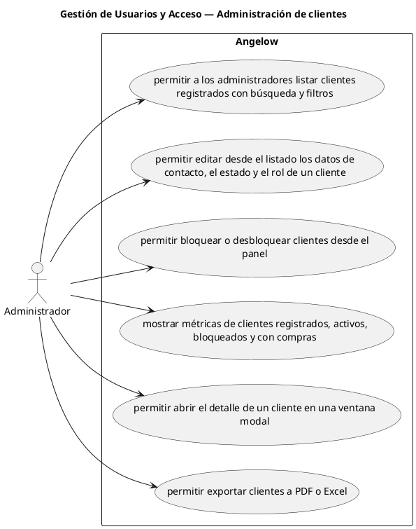

# Gestión de Usuarios y Acceso — Administración de clientes

> 6 casos de uso del subproceso.

## Casos cubiertos

- El sistema debe permitir a los administradores listar clientes registrados con búsqueda y filtros.
- El sistema debe permitir editar desde el listado los datos de contacto, el estado y el rol de un cliente.
- El sistema debe permitir bloquear o desbloquear clientes desde el panel.
- El sistema debe mostrar métricas de clientes registrados, activos, bloqueados y con compras.
- El sistema debe permitir abrir el detalle de un cliente en una ventana modal.
- El sistema debe permitir exportar clientes a PDF o Excel.

## Referencias

- [Índice de diagramas](../README.md)
- [Matriz de requerimientos funcionales](../../matriz-requerimientos-funcionales-actualizada.md)
- [Especificación de casos de uso](../../casos-uso-angelow.md)
