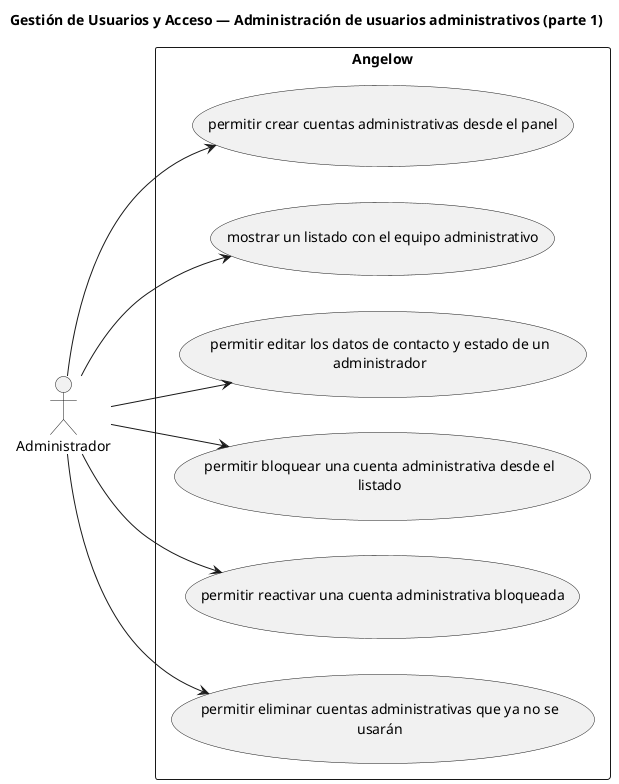

# Gestión de Usuarios y Acceso — Administración de usuarios administrativos (parte 1)

> 6 casos de uso del subproceso.

## Casos cubiertos

- El sistema debe permitir crear cuentas administrativas desde el panel.
- El sistema debe mostrar un listado con el equipo administrativo.
- El sistema debe permitir editar los datos de contacto y estado de un administrador.
- El sistema debe permitir bloquear una cuenta administrativa desde el listado.
- El sistema debe permitir reactivar una cuenta administrativa bloqueada.
- El sistema debe permitir eliminar cuentas administrativas que ya no se usarán.

## Referencias

- [Índice de diagramas](../README.md)
- [Matriz de requerimientos funcionales](../../matriz-requerimientos-funcionales-actualizada.md)
- [Especificación de casos de uso](../../casos-uso-angelow.md)
