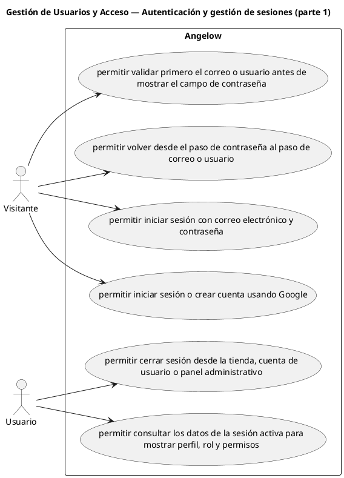

# Gestión de Usuarios y Acceso — Autenticación y gestión de sesiones (parte 1)

> 6 casos de uso del subproceso.

## Casos cubiertos

- El sistema debe permitir iniciar sesión con correo electrónico y contraseña.
- El sistema debe permitir iniciar sesión o crear cuenta usando Google.
- El sistema debe permitir cerrar sesión desde la tienda, cuenta de usuario o panel administrativo.
- El sistema debe permitir consultar los datos de la sesión activa para mostrar perfil, rol y permisos.
- El sistema debe permitir validar primero el correo o usuario antes de mostrar el campo de contraseña.
- El sistema debe permitir volver desde el paso de contraseña al paso de correo o usuario.

## Referencias

- [Índice de diagramas](../README.md)
- [Matriz de requerimientos funcionales](../../matriz-requerimientos-funcionales-actualizada.md)
- [Especificación de casos de uso](../../casos-uso-angelow.md)
