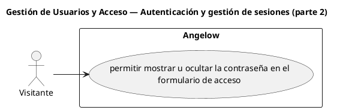

# Gestión de Usuarios y Acceso — Autenticación y gestión de sesiones (parte 2)

> 1 casos de uso y 1 requerimientos internos relacionados del subproceso.

## Casos cubiertos

- El sistema debe permitir mostrar u ocultar la contraseña en el formulario de acceso.

## Requerimientos internos relacionados

## Requerimientos internos relacionados

- El sistema debe validar que la pantalla de retorno después de iniciar sesión sea segura.
  - Tipo: validación interna.
  - Disparador: finaliza un inicio de sesión y existe una pantalla de retorno solicitada.
  - Actor directo: no aplica.
  - Contexto: sesión autenticada.
  - Representación: control interno de navegación segura.

## Referencias

- [Índice de diagramas](../README.md)
- [Matriz de requerimientos funcionales](../../matriz-requerimientos-funcionales-actualizada.md)
- [Especificación de casos de uso](../../casos-uso-angelow.md)
