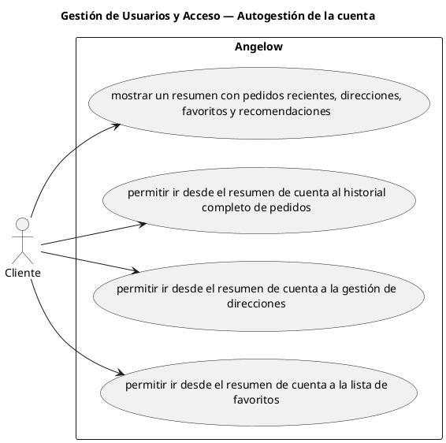

# Gestión de Usuarios y Acceso — Autogestión de la cuenta

> 4 casos de uso del subproceso.

## Casos cubiertos

- El sistema debe mostrar un resumen con pedidos recientes, direcciones, favoritos y recomendaciones.
- El sistema debe permitir ir desde el resumen de cuenta al historial completo de pedidos.
- El sistema debe permitir ir desde el resumen de cuenta a la gestión de direcciones.
- El sistema debe permitir ir desde el resumen de cuenta a la lista de favoritos.

## Referencias

- [Índice de diagramas](../README.md)
- [Matriz de requerimientos funcionales](../../matriz-requerimientos-funcionales-actualizada.md)
- [Especificación de casos de uso](../../casos-uso-angelow.md)
