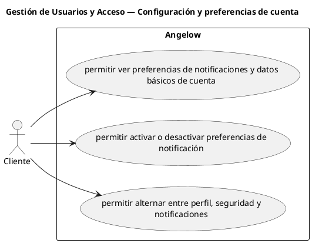

# Gestión de Usuarios y Acceso — Configuración y preferencias de cuenta

> 3 casos de uso del subproceso.

## Casos cubiertos

- El sistema debe permitir ver preferencias de notificaciones y datos básicos de cuenta.
- El sistema debe permitir activar o desactivar preferencias de notificación.
- El sistema debe permitir alternar entre perfil, seguridad y notificaciones.

## Referencias

- [Índice de diagramas](../README.md)
- [Matriz de requerimientos funcionales](../../matriz-requerimientos-funcionales-actualizada.md)
- [Especificación de casos de uso](../../casos-uso-angelow.md)
