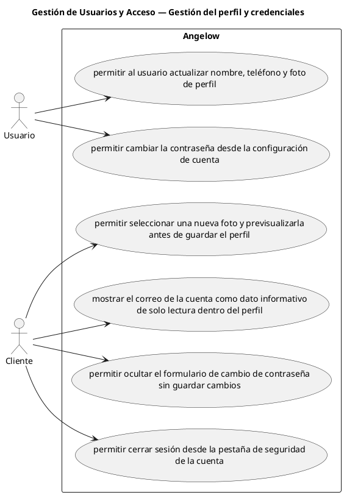

# Gestión de Usuarios y Acceso — Gestión del perfil y credenciales

> 6 casos de uso del subproceso.

## Casos cubiertos

- El sistema debe permitir al usuario actualizar nombre, teléfono y foto de perfil.
- El sistema debe permitir cambiar la contraseña desde la configuración de cuenta.
- El sistema debe permitir seleccionar una nueva foto y previsualizarla antes de guardar el perfil.
- El sistema debe mostrar el correo de la cuenta como dato informativo de solo lectura dentro del perfil.
- El sistema debe permitir ocultar el formulario de cambio de contraseña sin guardar cambios.
- El sistema debe permitir cerrar sesión desde la pestaña de seguridad de la cuenta.

## Referencias

- [Índice de diagramas](../README.md)
- [Matriz de requerimientos funcionales](../../matriz-requerimientos-funcionales-actualizada.md)
- [Especificación de casos de uso](../../casos-uso-angelow.md)
