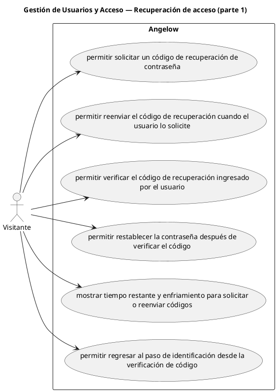

# Gestión de Usuarios y Acceso — Recuperación de acceso (parte 1)

> 6 casos de uso del subproceso.

## Casos cubiertos

- El sistema debe permitir solicitar un código de recuperación de contraseña.
- El sistema debe permitir reenviar el código de recuperación cuando el usuario lo solicite.
- El sistema debe permitir verificar el código de recuperación ingresado por el usuario.
- El sistema debe permitir restablecer la contraseña después de verificar el código.
- El sistema debe mostrar tiempo restante y enfriamiento para solicitar o reenviar códigos.
- El sistema debe permitir regresar al paso de identificación desde la verificación de código.

## Referencias

- [Índice de diagramas](../README.md)
- [Matriz de requerimientos funcionales](../../matriz-requerimientos-funcionales-actualizada.md)
- [Especificación de casos de uso](../../casos-uso-angelow.md)
