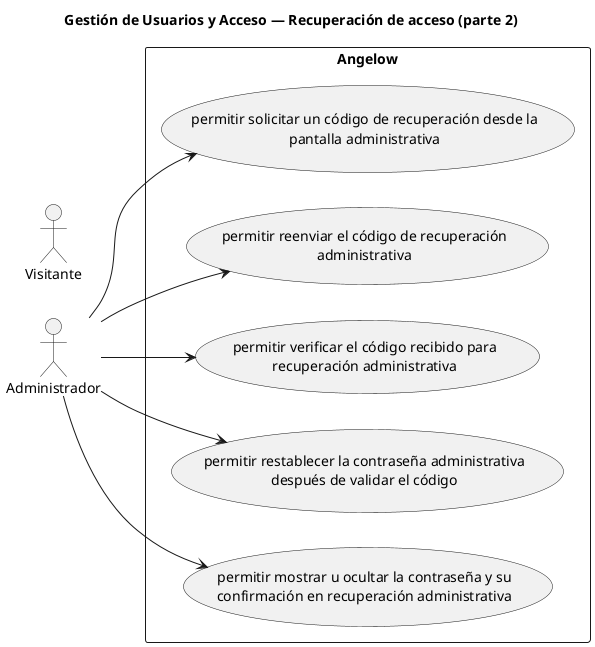

# Gestión de Usuarios y Acceso — Recuperación de acceso (parte 2)

> 5 casos de uso y 1 requerimientos internos relacionados del subproceso.

## Casos cubiertos

- El sistema debe permitir solicitar un código de recuperación desde la pantalla administrativa.
- El sistema debe permitir reenviar el código de recuperación administrativa.
- El sistema debe permitir verificar el código recibido para recuperación administrativa.
- El sistema debe permitir restablecer la contraseña administrativa después de validar el código.
- El sistema debe permitir mostrar u ocultar la contraseña y su confirmación en recuperación administrativa.

## Requerimientos internos relacionados

## Requerimientos internos relacionados

- El sistema debe usar el mismo componente visual para ingresar y reenviar códigos en registro y recuperación de contraseña.
  - Tipo: regla de interfaz interna.
  - Disparador: se muestran los flujos de ingreso o reenvío de códigos.
  - Actor directo: no aplica.
  - Contexto: registro o recuperación de acceso.
  - Representación: reutilización interna de componente visual.

## Referencias

- [Índice de diagramas](../README.md)
- [Matriz de requerimientos funcionales](../../matriz-requerimientos-funcionales-actualizada.md)
- [Especificación de casos de uso](../../casos-uso-angelow.md)
