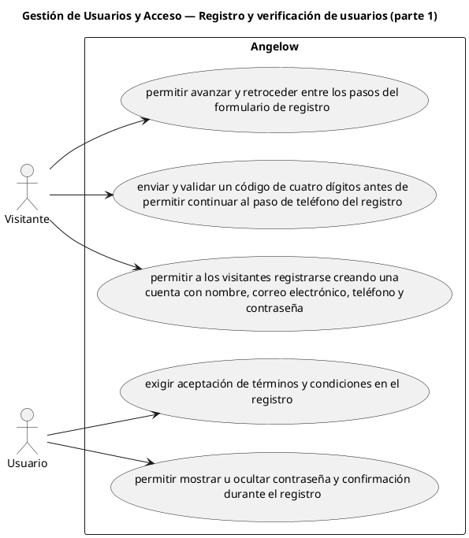

# Gestión de Usuarios y Acceso — Registro y verificación de usuarios (parte 1)

> 5 casos de uso y 1 requerimientos internos relacionados del subproceso.

## Casos cubiertos

- El sistema debe permitir a los visitantes registrarse creando una cuenta con nombre, correo electrónico, teléfono y contraseña.
- El sistema debe permitir avanzar y retroceder entre los pasos del formulario de registro.
- El sistema debe exigir aceptación de términos y condiciones en el registro.
- El sistema debe permitir mostrar u ocultar contraseña y confirmación durante el registro.
- El sistema debe enviar y validar un código de cuatro dígitos antes de permitir continuar al paso de teléfono del registro.

## Requerimientos internos relacionados

## Requerimientos internos relacionados

- El sistema debe validar nombre, correo, teléfono, contraseña, confirmación y términos mientras el usuario completa el registro.
  - Tipo: validación interna.
  - Disparador: el usuario modifica datos durante el registro.
  - Actor directo: no aplica.
  - Contexto: formulario de registro.
  - Representación: validación de campos previa al envío final.

## Referencias

- [Índice de diagramas](../README.md)
- [Matriz de requerimientos funcionales](../../matriz-requerimientos-funcionales-actualizada.md)
- [Especificación de casos de uso](../../casos-uso-angelow.md)
