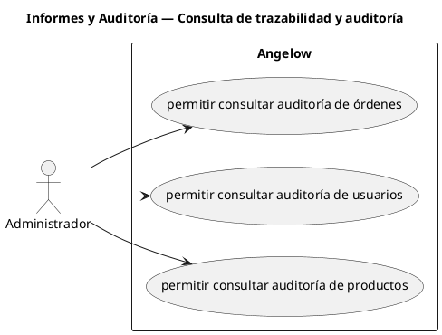

# Informes y Auditoría — Consulta de trazabilidad y auditoría

> 3 casos de uso del subproceso.

## Casos cubiertos

- El sistema debe permitir consultar auditoría de órdenes.
- El sistema debe permitir consultar auditoría de usuarios.
- El sistema debe permitir consultar auditoría de productos.

## Referencias

- [Índice de diagramas](../README.md)
- [Matriz de requerimientos funcionales](../../matriz-requerimientos-funcionales-actualizada.md)
- [Especificación de casos de uso](../../casos-uso-angelow.md)
