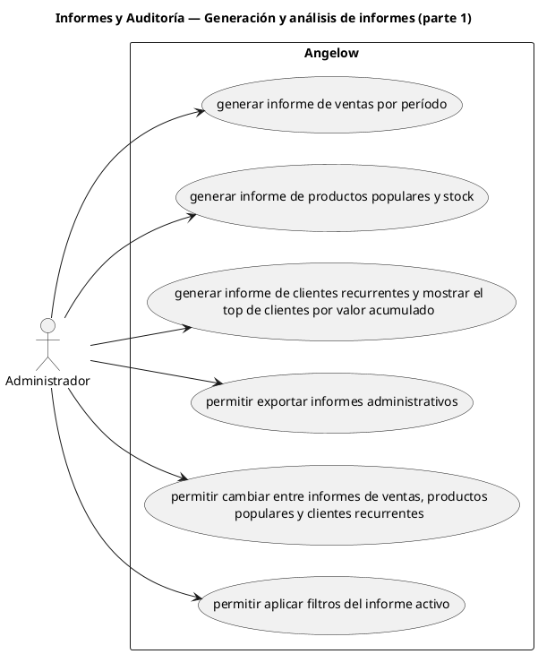

# Informes y Auditoría — Generación y análisis de informes (parte 1)

> 6 casos de uso del subproceso.

## Casos cubiertos

- El sistema debe generar informe de ventas por período.
- El sistema debe generar informe de productos populares y stock.
- El sistema debe generar informe de clientes recurrentes y mostrar el top de clientes por valor acumulado.
- El sistema debe permitir exportar informes administrativos.
- El sistema debe permitir cambiar entre informes de ventas, productos populares y clientes recurrentes.
- El sistema debe permitir aplicar filtros del informe activo.

## Referencias

- [Índice de diagramas](../README.md)
- [Matriz de requerimientos funcionales](../../matriz-requerimientos-funcionales-actualizada.md)
- [Especificación de casos de uso](../../casos-uso-angelow.md)
