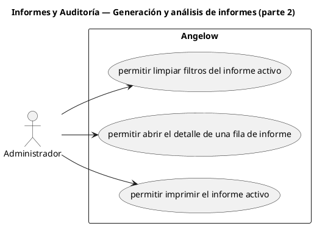

# Informes y Auditoría — Generación y análisis de informes (parte 2)

> 3 casos de uso del subproceso.

## Casos cubiertos

- El sistema debe permitir limpiar filtros del informe activo.
- El sistema debe permitir abrir el detalle de una fila de informe.
- El sistema debe permitir imprimir el informe activo.

## Referencias

- [Índice de diagramas](../README.md)
- [Matriz de requerimientos funcionales](../../matriz-requerimientos-funcionales-actualizada.md)
- [Especificación de casos de uso](../../casos-uso-angelow.md)
