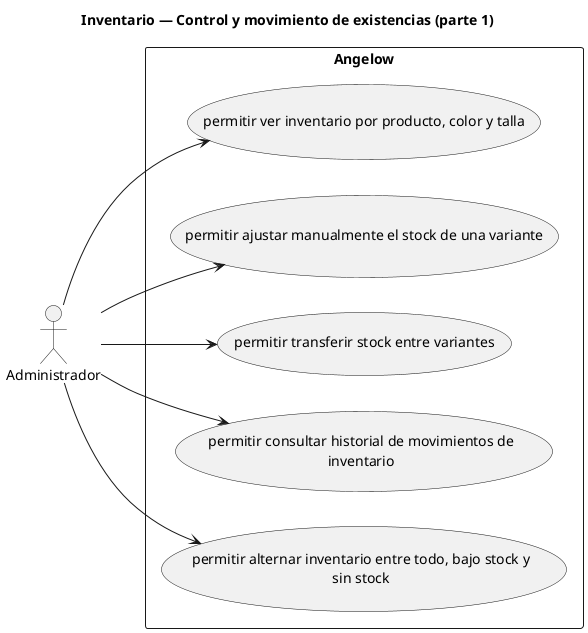

# Inventario — Control y movimiento de existencias (parte 1)

> 5 casos de uso y 1 requerimientos internos relacionados del subproceso.

## Casos cubiertos

- El sistema debe permitir ver inventario por producto, color y talla.
- El sistema debe permitir ajustar manualmente el stock de una variante.
- El sistema debe permitir transferir stock entre variantes.
- El sistema debe permitir consultar historial de movimientos de inventario.
- El sistema debe permitir alternar inventario entre todo, bajo stock y sin stock.

## Requerimientos internos relacionados

## Requerimientos internos relacionados

- El sistema debe descontar o confirmar inventario cuando se confirma una orden.
  - Tipo: automatismo interno de inventario.
  - Disparador: se confirma una orden.
  - Actor directo: no aplica.
  - Contexto: orden confirmada.
  - Representación: actualización interna de existencias; no hay una acción administrativa que la inicie.

## Referencias

- [Índice de diagramas](../README.md)
- [Matriz de requerimientos funcionales](../../matriz-requerimientos-funcionales-actualizada.md)
- [Especificación de casos de uso](../../casos-uso-angelow.md)
