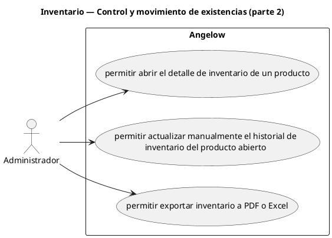

# Inventario — Control y movimiento de existencias (parte 2)

> 3 casos de uso del subproceso.

## Casos cubiertos

- El sistema debe permitir abrir el detalle de inventario de un producto.
- El sistema debe permitir actualizar manualmente el historial de inventario del producto abierto.
- El sistema debe permitir exportar inventario a PDF o Excel.

## Referencias

- [Índice de diagramas](../README.md)
- [Matriz de requerimientos funcionales](../../matriz-requerimientos-funcionales-actualizada.md)
- [Especificación de casos de uso](../../casos-uso-angelow.md)
