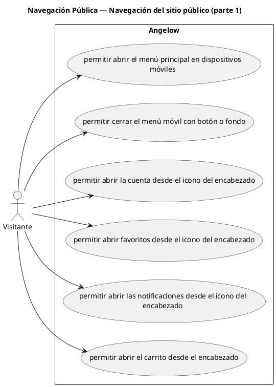

# Navegación Pública — Navegación del sitio público (parte 1)

> 6 casos de uso del subproceso.

## Casos cubiertos

- El sistema debe permitir abrir el menú principal en dispositivos móviles.
- El sistema debe permitir cerrar el menú móvil con botón o fondo.
- El sistema debe permitir abrir la cuenta desde el icono del encabezado.
- El sistema debe permitir abrir favoritos desde el icono del encabezado.
- El sistema debe permitir abrir las notificaciones desde el icono del encabezado.
- El sistema debe permitir abrir el carrito desde el encabezado.

## Referencias

- [Índice de diagramas](../README.md)
- [Matriz de requerimientos funcionales](../../matriz-requerimientos-funcionales-actualizada.md)
- [Especificación de casos de uso](../../casos-uso-angelow.md)
