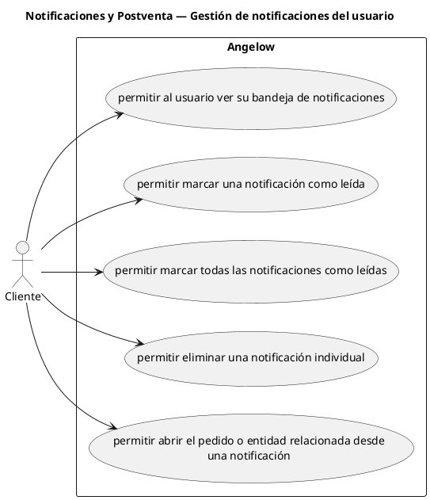

# Notificaciones y Postventa — Gestión de notificaciones del usuario

> 5 casos de uso y 1 requerimientos internos relacionados del subproceso.

## Casos cubiertos

- El sistema debe permitir al usuario ver su bandeja de notificaciones.
- El sistema debe permitir marcar una notificación como leída.
- El sistema debe permitir marcar todas las notificaciones como leídas.
- El sistema debe permitir eliminar una notificación individual.
- El sistema debe permitir abrir el pedido o entidad relacionada desde una notificación.

## Requerimientos internos relacionados

## Requerimientos internos relacionados

- El sistema debe actualizar periódicamente el contador de notificaciones sin leer.
  - Tipo: automatismo periódico.
  - Disparador: intervalo de actualización mientras existe una sesión autenticada.
  - Actor directo: no aplica.
  - Contexto: usuario autenticado.
  - Representación: comportamiento interno asociado a la gestión de notificaciones.

## Referencias

- [Índice de diagramas](../README.md)
- [Matriz de requerimientos funcionales](../../matriz-requerimientos-funcionales-actualizada.md)
- [Especificación de casos de uso](../../casos-uso-angelow.md)
