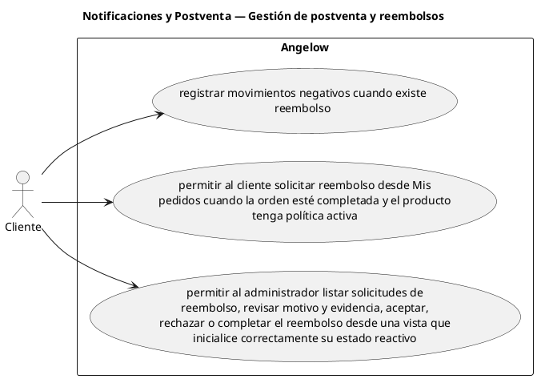

# Notificaciones y Postventa — Gestión de postventa y reembolsos

> 3 casos de uso y 2 requerimientos internos relacionados del subproceso.

## Casos cubiertos

- El sistema debe registrar movimientos negativos cuando existe reembolso.
- El sistema debe permitir al cliente solicitar reembolso desde Mis pedidos cuando la orden esté completada y el producto tenga política activa.
- El sistema debe permitir al administrador listar solicitudes de reembolso, revisar motivo y evidencia, aceptar, rechazar o completar el reembolso desde una vista que inicialice correctamente su estado reactivo.

## Requerimientos internos relacionados

- El sistema debe generar y enviar factura cuando una orden pasa a entregada.
  - Tipo: automatismo interno.
  - Disparador: una orden pasa a entregada.
  - Actor directo: no aplica.
  - Representación: comportamiento posterior al cambio de estado de la orden.
- El sistema debe notificar al cliente cuando una orden se cancela.
  - Tipo: automatismo interno.
  - Disparador: una orden se cancela.
  - Actor directo: no aplica.
  - Representación: comportamiento posterior al cambio de estado de la orden.

## Referencias

- [Índice de diagramas](../README.md)
- [Matriz de requerimientos funcionales](../../matriz-requerimientos-funcionales-actualizada.md)
- [Especificación de casos de uso](../../casos-uso-angelow.md)
