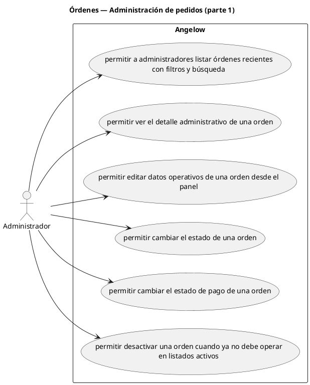

# Órdenes — Administración de pedidos (parte 1)

> 6 casos de uso del subproceso.

## Casos cubiertos

- El sistema debe permitir a administradores listar órdenes recientes con filtros y búsqueda.
- El sistema debe permitir ver el detalle administrativo de una orden.
- El sistema debe permitir editar datos operativos de una orden desde el panel.
- El sistema debe permitir cambiar el estado de una orden.
- El sistema debe permitir cambiar el estado de pago de una orden.
- El sistema debe permitir desactivar una orden cuando ya no debe operar en listados activos.

## Referencias

- [Índice de diagramas](../README.md)
- [Matriz de requerimientos funcionales](../../matriz-requerimientos-funcionales-actualizada.md)
- [Especificación de casos de uso](../../casos-uso-angelow.md)
