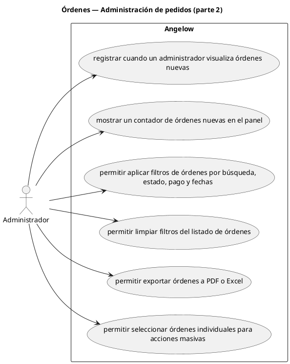

# Órdenes — Administración de pedidos (parte 2)

> 6 casos de uso del subproceso.

## Casos cubiertos

- El sistema debe registrar cuando un administrador visualiza órdenes nuevas.
- El sistema debe mostrar un contador de órdenes nuevas en el panel.
- El sistema debe permitir aplicar filtros de órdenes por búsqueda, estado, pago y fechas.
- El sistema debe permitir limpiar filtros del listado de órdenes.
- El sistema debe permitir exportar órdenes a PDF o Excel.
- El sistema debe permitir seleccionar órdenes individuales para acciones masivas.

## Referencias

- [Índice de diagramas](../README.md)
- [Matriz de requerimientos funcionales](../../matriz-requerimientos-funcionales-actualizada.md)
- [Especificación de casos de uso](../../casos-uso-angelow.md)
