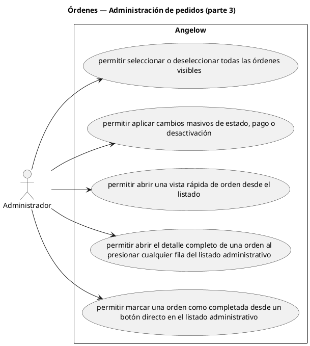

# Órdenes — Administración de pedidos (parte 3)

> 5 casos de uso y 1 requerimientos internos relacionados del subproceso.

## Casos cubiertos

- El sistema debe permitir seleccionar o deseleccionar todas las órdenes visibles.
- El sistema debe permitir aplicar cambios masivos de estado, pago o desactivación.
- El sistema debe permitir abrir una vista rápida de orden desde el listado.
- El sistema debe permitir abrir el detalle completo de una orden al presionar cualquier fila del listado administrativo.
- El sistema debe permitir marcar una orden como completada desde un botón directo en el listado administrativo.

## Requerimientos internos relacionados

## Requerimientos internos relacionados

- El sistema debe pasar el pago a reembolso en proceso cuando una orden cancelada recibe verificación de pago.
  - Tipo: automatismo por cambio de estado.
  - Disparador: una orden cancelada recibe verificación de pago.
  - Actor directo: no aplica.
  - Contexto: orden cancelada.
  - Representación: inicio interno del flujo de reembolso.

## Referencias

- [Índice de diagramas](../README.md)
- [Matriz de requerimientos funcionales](../../matriz-requerimientos-funcionales-actualizada.md)
- [Especificación de casos de uso](../../casos-uso-angelow.md)
