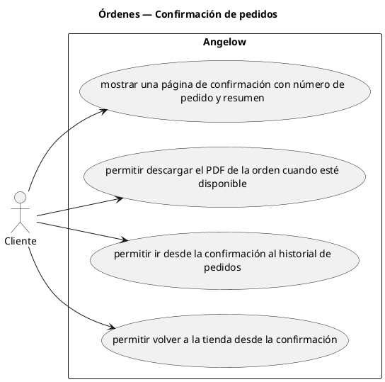

# Órdenes — Confirmación de pedidos

> 4 casos de uso del subproceso.

## Casos cubiertos

- El sistema debe mostrar una página de confirmación con número de pedido y resumen.
- El sistema debe permitir descargar el PDF de la orden cuando esté disponible.
- El sistema debe permitir ir desde la confirmación al historial de pedidos.
- El sistema debe permitir volver a la tienda desde la confirmación.

## Referencias

- [Índice de diagramas](../README.md)
- [Matriz de requerimientos funcionales](../../matriz-requerimientos-funcionales-actualizada.md)
- [Especificación de casos de uso](../../casos-uso-angelow.md)
