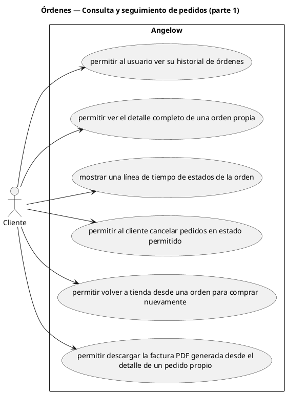

# Órdenes — Consulta y seguimiento de pedidos (parte 1)

> 6 casos de uso del subproceso.

## Casos cubiertos

- El sistema debe permitir al usuario ver su historial de órdenes.
- El sistema debe permitir ver el detalle completo de una orden propia.
- El sistema debe mostrar una línea de tiempo de estados de la orden.
- El sistema debe permitir al cliente cancelar pedidos en estado permitido.
- El sistema debe permitir volver a tienda desde una orden para comprar nuevamente.
- El sistema debe permitir descargar la factura PDF generada desde el detalle de un pedido propio.

## Referencias

- [Índice de diagramas](../README.md)
- [Matriz de requerimientos funcionales](../../matriz-requerimientos-funcionales-actualizada.md)
- [Especificación de casos de uso](../../casos-uso-angelow.md)
