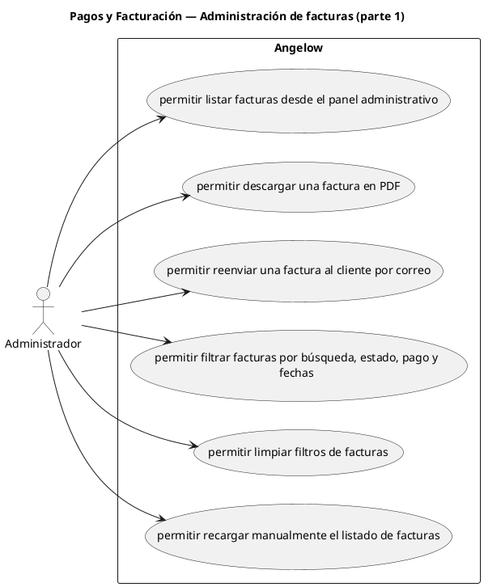

# Pagos y Facturación — Administración de facturas (parte 1)

> 6 casos de uso del subproceso.

## Casos cubiertos

- El sistema debe permitir listar facturas desde el panel administrativo.
- El sistema debe permitir descargar una factura en PDF.
- El sistema debe permitir reenviar una factura al cliente por correo.
- El sistema debe permitir filtrar facturas por búsqueda, estado, pago y fechas.
- El sistema debe permitir limpiar filtros de facturas.
- El sistema debe permitir recargar manualmente el listado de facturas.

## Referencias

- [Índice de diagramas](../README.md)
- [Matriz de requerimientos funcionales](../../matriz-requerimientos-funcionales-actualizada.md)
- [Especificación de casos de uso](../../casos-uso-angelow.md)
