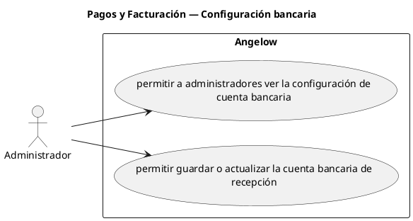

# Pagos y Facturación — Configuración bancaria

> 2 casos de uso y 1 requerimientos internos relacionados del subproceso.

## Casos cubiertos

- El sistema debe permitir a administradores ver la configuración de cuenta bancaria.
- El sistema debe permitir guardar o actualizar la cuenta bancaria de recepción.

## Requerimientos internos relacionados

## Requerimientos internos relacionados

- El sistema debe listar el catálogo de bancos colombianos activos para formularios de pago y configuración bancaria.
  - Tipo: carga interna de información.
  - Disparador: se abre un formulario de pago o configuración bancaria.
  - Actor directo: no aplica.
  - Contexto: formulario bancario.
  - Representación: consulta interna del catálogo de bancos activos.

## Referencias

- [Índice de diagramas](../README.md)
- [Matriz de requerimientos funcionales](../../matriz-requerimientos-funcionales-actualizada.md)
- [Especificación de casos de uso](../../casos-uso-angelow.md)
