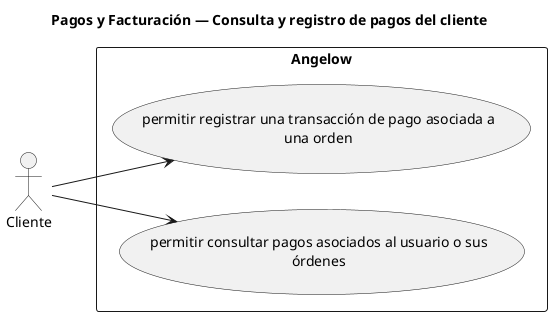

# Pagos y Facturación — Consulta y registro de pagos del cliente

> 2 casos de uso del subproceso.

## Casos cubiertos

- El sistema debe permitir registrar una transacción de pago asociada a una orden.
- El sistema debe permitir consultar pagos asociados al usuario o sus órdenes.

## Referencias

- [Índice de diagramas](../README.md)
- [Matriz de requerimientos funcionales](../../matriz-requerimientos-funcionales-actualizada.md)
- [Especificación de casos de uso](../../casos-uso-angelow.md)
