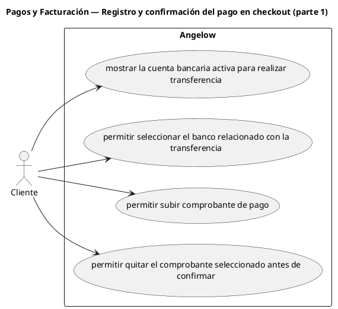

# Pagos y Facturación — Registro y confirmación del pago en checkout (parte 1)

> 4 casos de uso y 2 requerimientos internos relacionados del subproceso.

## Casos cubiertos

- El sistema debe mostrar la cuenta bancaria activa para realizar transferencia.
- El sistema debe permitir seleccionar el banco relacionado con la transferencia.
- El sistema debe permitir subir comprobante de pago.
- El sistema debe permitir quitar el comprobante seleccionado antes de confirmar.

## Requerimientos internos relacionados

## Requerimientos internos relacionados

- El sistema debe exigir el número de referencia de transferencia.
  - Tipo: validación interna.
  - Disparador: se intenta registrar una transferencia.
  - Actor directo: no aplica.
  - Contexto: checkout con transferencia.
  - Representación: comprobación interna del número de referencia.
- El sistema debe exigir aceptación de términos antes de crear la orden.
  - Tipo: validación interna.
  - Disparador: se intenta crear una orden.
  - Actor directo: no aplica.
  - Contexto: checkout activo.
  - Representación: comprobación interna de aceptación de términos.

## Referencias

- [Índice de diagramas](../README.md)
- [Matriz de requerimientos funcionales](../../matriz-requerimientos-funcionales-actualizada.md)
- [Especificación de casos de uso](../../casos-uso-angelow.md)
