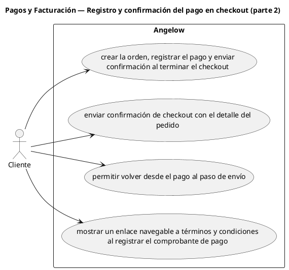

# Pagos y Facturación — Registro y confirmación del pago en checkout (parte 2)

> 4 casos de uso del subproceso.

## Casos cubiertos

- El sistema debe crear la orden, registrar el pago y enviar confirmación al terminar el checkout.
- El sistema debe enviar confirmación de checkout con el detalle del pedido.
- El sistema debe permitir volver desde el pago al paso de envío.
- El sistema debe mostrar un enlace navegable a términos y condiciones al registrar el comprobante de pago.

## Referencias

- [Índice de diagramas](../README.md)
- [Matriz de requerimientos funcionales](../../matriz-requerimientos-funcionales-actualizada.md)
- [Especificación de casos de uso](../../casos-uso-angelow.md)
