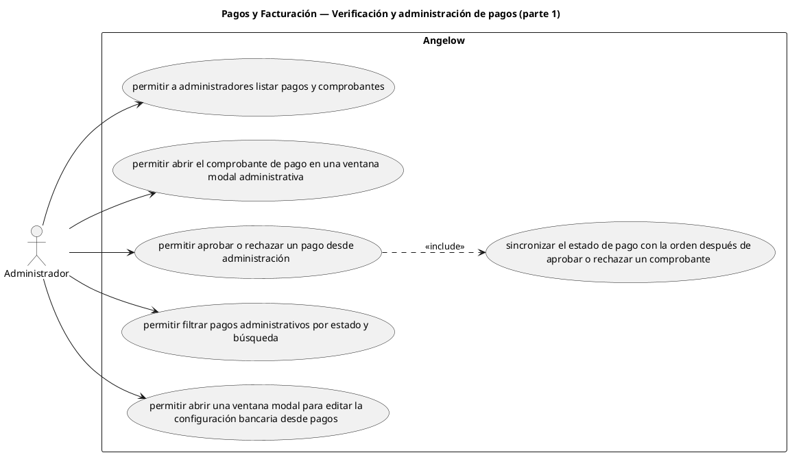

# Pagos y Facturación — Verificación y administración de pagos (parte 1)

> 6 casos de uso del subproceso.

## Casos cubiertos

- El sistema debe permitir a administradores listar pagos y comprobantes.
- El sistema debe permitir abrir el comprobante de pago en una ventana modal administrativa.
- El sistema debe permitir aprobar o rechazar un pago desde administración.
- El sistema debe permitir filtrar pagos administrativos por estado y búsqueda.
- El sistema debe permitir abrir una ventana modal para editar la configuración bancaria desde pagos.
- El sistema debe sincronizar el estado de pago con la orden después de aprobar o rechazar un comprobante.

## Referencias

- [Índice de diagramas](../README.md)
- [Matriz de requerimientos funcionales](../../matriz-requerimientos-funcionales-actualizada.md)
- [Especificación de casos de uso](../../casos-uso-angelow.md)
