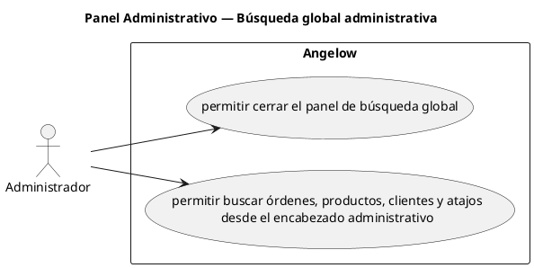

# Panel Administrativo — Búsqueda global administrativa

> 2 casos de uso del subproceso.

## Casos cubiertos

- El sistema debe permitir cerrar el panel de búsqueda global.
- El sistema debe permitir buscar órdenes, productos, clientes y atajos desde el encabezado administrativo.

## Referencias

- [Índice de diagramas](../README.md)
- [Matriz de requerimientos funcionales](../../matriz-requerimientos-funcionales-actualizada.md)
- [Especificación de casos de uso](../../casos-uso-angelow.md)
