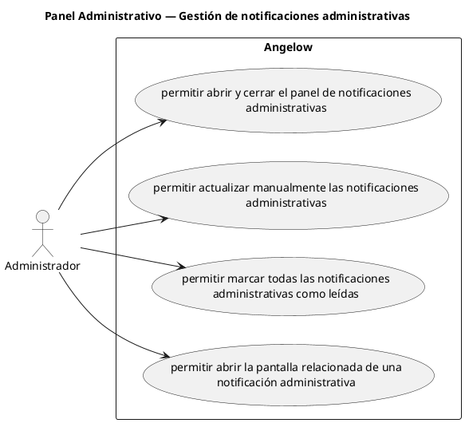

# Panel Administrativo — Gestión de notificaciones administrativas

> 4 casos de uso del subproceso.

## Casos cubiertos

- El sistema debe permitir abrir y cerrar el panel de notificaciones administrativas.
- El sistema debe permitir actualizar manualmente las notificaciones administrativas.
- El sistema debe permitir marcar todas las notificaciones administrativas como leídas.
- El sistema debe permitir abrir la pantalla relacionada de una notificación administrativa.

## Referencias

- [Índice de diagramas](../README.md)
- [Matriz de requerimientos funcionales](../../matriz-requerimientos-funcionales-actualizada.md)
- [Especificación de casos de uso](../../casos-uso-angelow.md)
