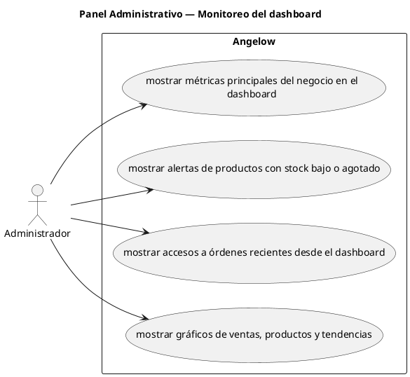

# Panel Administrativo — Monitoreo del dashboard

> 4 casos de uso del subproceso.

## Casos cubiertos

- El sistema debe mostrar métricas principales del negocio en el dashboard.
- El sistema debe mostrar alertas de productos con stock bajo o agotado.
- El sistema debe mostrar accesos a órdenes recientes desde el dashboard.
- El sistema debe mostrar gráficos de ventas, productos y tendencias.

## Referencias

- [Índice de diagramas](../README.md)
- [Matriz de requerimientos funcionales](../../matriz-requerimientos-funcionales-actualizada.md)
- [Especificación de casos de uso](../../casos-uso-angelow.md)
