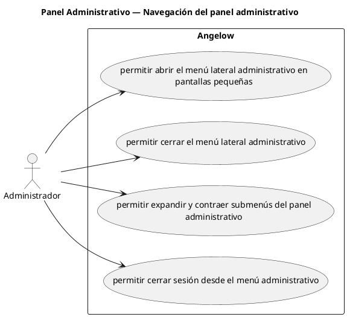

# Panel Administrativo — Navegación del panel administrativo

> 4 casos de uso del subproceso.

## Casos cubiertos

- El sistema debe permitir abrir el menú lateral administrativo en pantallas pequeñas.
- El sistema debe permitir cerrar el menú lateral administrativo.
- El sistema debe permitir expandir y contraer submenús del panel administrativo.
- El sistema debe permitir cerrar sesión desde el menú administrativo.

## Referencias

- [Índice de diagramas](../README.md)
- [Matriz de requerimientos funcionales](../../matriz-requerimientos-funcionales-actualizada.md)
- [Especificación de casos de uso](../../casos-uso-angelow.md)
