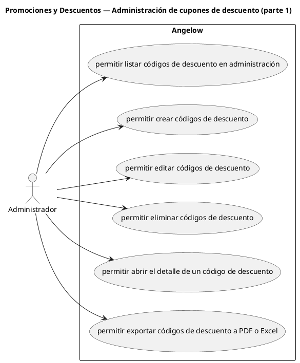

# Promociones y Descuentos — Administración de cupones de descuento (parte 1)

> 6 casos de uso del subproceso.

## Casos cubiertos

- El sistema debe permitir listar códigos de descuento en administración.
- El sistema debe permitir crear códigos de descuento.
- El sistema debe permitir editar códigos de descuento.
- El sistema debe permitir eliminar códigos de descuento.
- El sistema debe permitir abrir el detalle de un código de descuento.
- El sistema debe permitir exportar códigos de descuento a PDF o Excel.

## Referencias

- [Índice de diagramas](../README.md)
- [Matriz de requerimientos funcionales](../../matriz-requerimientos-funcionales-actualizada.md)
- [Especificación de casos de uso](../../casos-uso-angelow.md)
