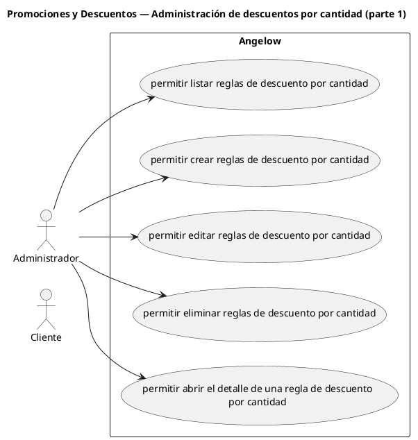

# Promociones y Descuentos — Administración de descuentos por cantidad (parte 1)

> 5 casos de uso y 1 requerimientos internos relacionados del subproceso.

## Casos cubiertos

- El sistema debe permitir listar reglas de descuento por cantidad.
- El sistema debe permitir crear reglas de descuento por cantidad.
- El sistema debe permitir editar reglas de descuento por cantidad.
- El sistema debe permitir eliminar reglas de descuento por cantidad.
- El sistema debe permitir abrir el detalle de una regla de descuento por cantidad.

## Requerimientos internos relacionados

- El sistema debe validar descuentos automáticos por cantidad en el carrito.
  - Tipo: validación interna.
  - Disparador: el carrito contiene cantidades que pueden satisfacer una regla automática.
  - Actor directo: no aplica.
  - Representación: regla interna del cálculo del carrito; no se usa <<include>> porque puede ejecutarse desde varias acciones que alteran sus cantidades.

## Referencias

- [Índice de diagramas](../README.md)
- [Matriz de requerimientos funcionales](../../matriz-requerimientos-funcionales-actualizada.md)
- [Especificación de casos de uso](../../casos-uso-angelow.md)
