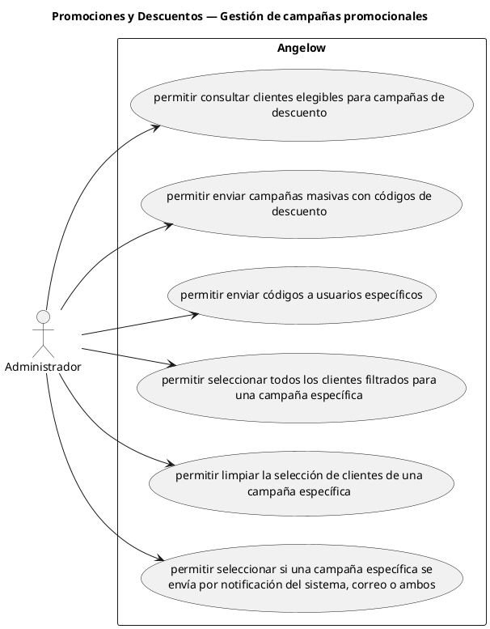

# Promociones y Descuentos — Gestión de campañas promocionales

> 6 casos de uso del subproceso.

## Casos cubiertos

- El sistema debe permitir consultar clientes elegibles para campañas de descuento.
- El sistema debe permitir enviar campañas masivas con códigos de descuento.
- El sistema debe permitir enviar códigos a usuarios específicos.
- El sistema debe permitir seleccionar todos los clientes filtrados para una campaña específica.
- El sistema debe permitir limpiar la selección de clientes de una campaña específica.
- El sistema debe permitir seleccionar si una campaña específica se envía por notificación del sistema, correo o ambos.

## Referencias

- [Índice de diagramas](../README.md)
- [Matriz de requerimientos funcionales](../../matriz-requerimientos-funcionales-actualizada.md)
- [Especificación de casos de uso](../../casos-uso-angelow.md)
