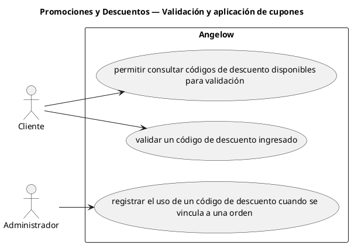

# Promociones y Descuentos — Validación y aplicación de cupones

> 3 casos de uso y 1 requerimientos internos relacionados del subproceso.

## Casos cubiertos

- El sistema debe permitir consultar códigos de descuento disponibles para validación.
- El sistema debe validar un código de descuento ingresado.
- El sistema debe registrar el uso de un código de descuento cuando se vincula a una orden.

## Requerimientos internos relacionados

## Requerimientos internos relacionados

- El sistema debe conservar descuentos aplicados o asignados al usuario hasta que sean usados o expiren.
  - Tipo: regla funcional interna.
  - Disparador: un descuento aplicado se consume o alcanza su vencimiento.
  - Actor directo: no aplica.
  - Contexto: descuento aplicado.
  - Representación: conservación y actualización interna de su estado.

## Referencias

- [Índice de diagramas](../README.md)
- [Matriz de requerimientos funcionales](../../matriz-requerimientos-funcionales-actualizada.md)
- [Especificación de casos de uso](../../casos-uso-angelow.md)
