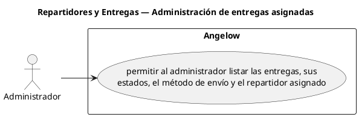

# Repartidores y Entregas — Administración de entregas asignadas

> 1 casos de uso del subproceso.

## Casos cubiertos

- El sistema debe permitir al administrador listar las entregas, sus estados, el método de envío y el repartidor asignado.

## Referencias

- [Índice de diagramas](../README.md)
- [Matriz de requerimientos funcionales](../../matriz-requerimientos-funcionales-actualizada.md)
- [Especificación de casos de uso](../../casos-uso-angelow.md)
