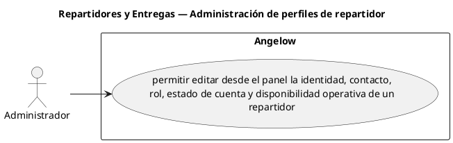

# Repartidores y Entregas — Administración de perfiles de repartidor

> 1 casos de uso del subproceso.

## Casos cubiertos

- El sistema debe permitir editar desde el panel la identidad, contacto, rol, estado de cuenta y disponibilidad operativa de un repartidor.

## Referencias

- [Índice de diagramas](../README.md)
- [Matriz de requerimientos funcionales](../../matriz-requerimientos-funcionales-actualizada.md)
- [Especificación de casos de uso](../../casos-uso-angelow.md)
