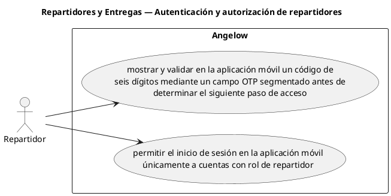

# Repartidores y Entregas — Autenticación y autorización de repartidores

> 2 casos de uso del subproceso.

## Casos cubiertos

- El sistema debe mostrar y validar en la aplicación móvil un código de seis dígitos mediante un campo OTP segmentado antes de determinar el siguiente paso de acceso.
- El sistema debe permitir el inicio de sesión en la aplicación móvil únicamente a cuentas con rol de repartidor.

## Referencias

- [Índice de diagramas](../README.md)
- [Matriz de requerimientos funcionales](../../matriz-requerimientos-funcionales-actualizada.md)
- [Especificación de casos de uso](../../casos-uso-angelow.md)
