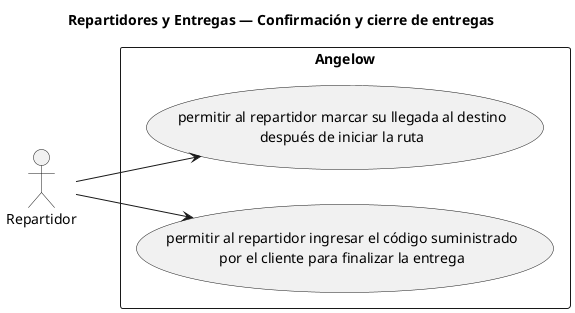

# Repartidores y Entregas — Confirmación y cierre de entregas

> 2 casos de uso y 1 requerimientos internos relacionados del subproceso.

## Casos cubiertos

- El sistema debe permitir al repartidor marcar su llegada al destino después de iniciar la ruta.
- El sistema debe permitir al repartidor ingresar el código suministrado por el cliente para finalizar la entrega.

## Requerimientos internos relacionados

- El sistema debe generar un código de seis dígitos al asignar un repartidor.
  - Tipo: automatismo interno.
  - Disparador: se asigna un repartidor.
  - Actor directo: no aplica.
  - Representación: comportamiento interno posterior a la asignación; la matriz no determina un único caso base de asignación.

## Referencias

- [Índice de diagramas](../README.md)
- [Matriz de requerimientos funcionales](../../matriz-requerimientos-funcionales-actualizada.md)
- [Especificación de casos de uso](../../casos-uso-angelow.md)
