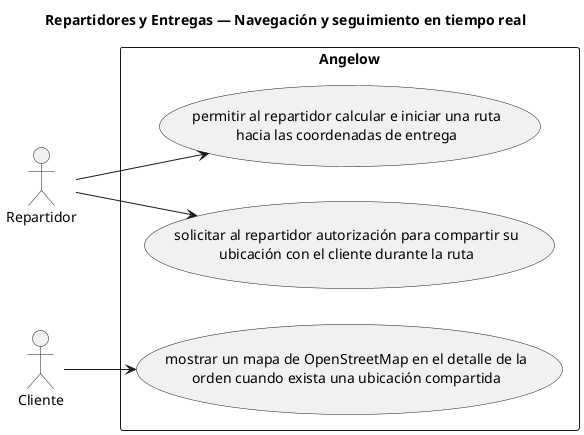

# Repartidores y Entregas — Navegación y seguimiento en tiempo real

> 3 casos de uso del subproceso.

## Casos cubiertos

- El sistema debe permitir al repartidor calcular e iniciar una ruta hacia las coordenadas de entrega.
- El sistema debe solicitar al repartidor autorización para compartir su ubicación con el cliente durante la ruta.
- El sistema debe mostrar un mapa de OpenStreetMap en el detalle de la orden cuando exista una ubicación compartida.

## Referencias

- [Índice de diagramas](../README.md)
- [Matriz de requerimientos funcionales](../../matriz-requerimientos-funcionales-actualizada.md)
- [Especificación de casos de uso](../../casos-uso-angelow.md)
